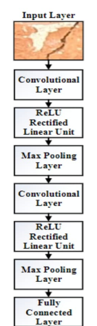

# Project Title

Surface Cracks Detection using Convolutional Neural Networks.

## Table of Contents

- [About](#about)
- [Getting Started](#getting_started)
- [Usage](#usage)
- [Contributing](../CONTRIBUTING.md)

## About 
 Concrete cracking is a major issue in Bridge Engineering. Detection of cracks facilitates the design, construction and maintenance of bridges effectively. This project is focussed on creating a Deep Learning model, CNN in our case to identify concrete cracks. The model is trained with images. We used greyscale conversion for preprocessing.

## Problem Statement 

1) Use open source dataset (From the link: https://cutt.ly/PS_1_dataset)
2) Develop a suitable Deep Learning framework which can detect the crack in the image from the dataset
3) Transfer Learning based DL framework would be appreciated

### Prerequisites

Jupyter notebook in Anaconda package is used to write and test code.
Dataset used : https://www.kaggle.com/datasets/xinzone/surface-crack

### Installing

Download Anaconda from https://www.anaconda.com/
Use Jupyter notebook from the Anaconda Navigator.
One can also use Jupyter standalone package.
Check https://jupyter.org/install for more info

## Usage 

This model can be integrated into applications which can be used to identify concrete cracks.
CNN architechture: 
 

